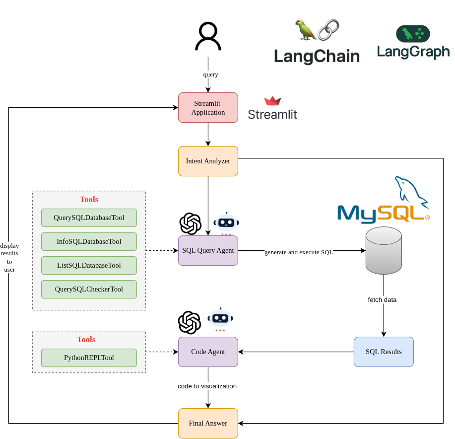
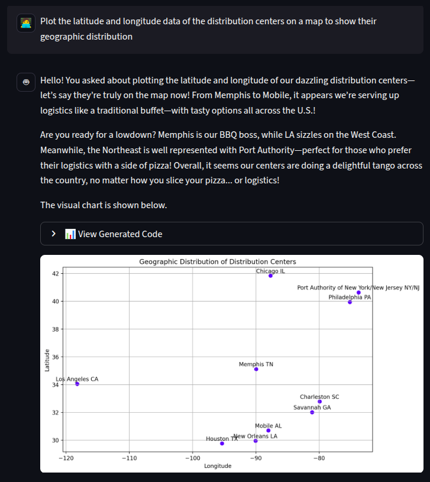
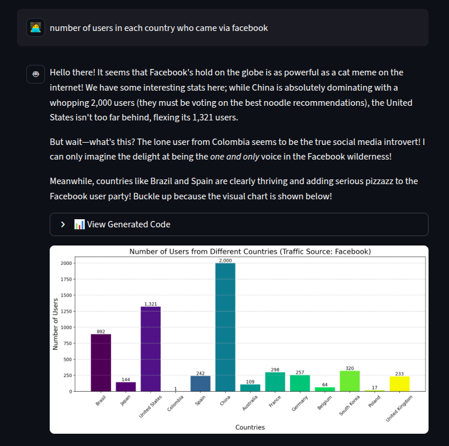

# QueryViz AI

## Project Overview
This project demonstrates the development of a **Streamlit chatbot** integrated with **LangChain** and **OpenAI GPT-4**, enabling natural language interaction with a SQL database. Users can ask questions in plain language, and the chatbot generates SQL queries, retrieves relevant data, and dynamically produces visualizations using Python libraries such as **Matplotlib** or **Plotly**.

No more manual filtering or complex SQL commands—just ask, and the bot provides intelligent, insightful, visual answers in seconds.

---

## System Architecture
The architecture of the Streamlit LangChain Chatbot consists of a SQL Agent for query generation, a Python Agent for visualization, and a Streamlit interface for interactive chat.  

  
*Figure: System Architecture Overview*

---

## Demo

  
  

<em>Figure: Chatbot Demo with Query and Visualization</em>

---

## Key Features
- **Natural Language to SQL:** Users input questions in plain English, and the chatbot translates them into optimized SQL queries.  
- **Dynamic Visualization:** Automatically generates Python code to create charts and graphs from query results.  
- **Interactive Streamlit Interface:** Provides a user-friendly, real-time chat interface.  
- **Memory & Guardrails:** Maintains conversation context and ensures safe, relevant outputs.

## 📦 E-commerce Database Overview  

This database contains **7 interconnected datasets** that capture the full lifecycle of an e-commerce platform — from user interactions to inventory management and order fulfillment.  

### Datasets  

1. **Distribution Centers** *(10 rows, 4 cols)*  
   Location info of warehouses:  
   `id`, `name`, `latitude`, `longitude`  

2. **Events** *(2,427,931 rows, 13 cols)*  
   User activity logs:  
   `user_id`, `session_id`, `sequence_number`, `created_at`, `ip_address`, `city`, `state`, `postal_code`, `browser`, `traffic_source`, `uri`, `event_type`  

3. **Inventory Items** *(491,098 rows, 12 cols)*  
   Product stock details:  
   `product_id`, `created_at`, `sold_at`, `cost`, `product_category`, `product_name`, `product_brand`, `product_retail_price`, `product_department`, `product_sku`, `product_distribution_center_id`  

4. **Order Items** *(181,891 rows, 11 cols)*  
   Transaction-level details:  
   `order_id`, `user_id`, `product_id`, `inventory_item_id`, `status`, `created_at`, `shipped_at`, `delivered_at`, `returned_at`, `sale_price`  

5. **Orders** *(125,530 rows, 9 cols)*  
   Order-level details:  
   `order_id`, `user_id`, `status`, `gender`, `created_at`, `returned_at`, `shipped_at`, `delivered_at`, `num_of_item`  

6. **Products** *(29,120 rows, 9 cols)*  
   Product catalog:  
   `id`, `name`, `brand`, `category`, `department`, `sku`, `cost`, `retail_price`, `distribution_center_id`  

7. **Users** *(100,000 rows, 15 cols)*  
   Customer profiles:  
   `id`, `first_name`, `last_name`, `email`, `age`, `gender`, `address fields (street, city, state, postal_code, country)`, `latitude`, `longitude`, `traffic_source`, `created_at`  

